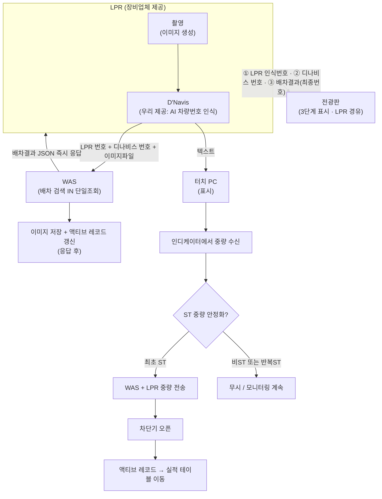
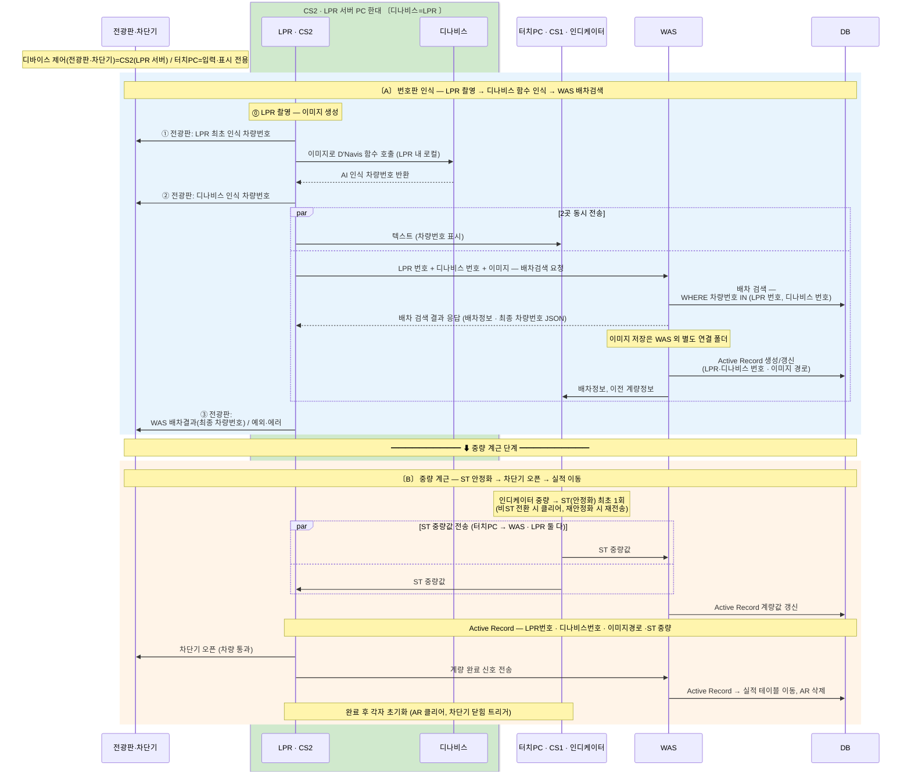

# 2026.0624

- **날짜**: 2026-06-24
- **시간**: 05:04 ~ 06:28
- **상태**: 완료
- **생성자**: 관리자

---

## AI 회의록

# 2026.0624

## 핵심 요약

* 차량 계량 시스템 전체 아키텍처를 LPR·WAS·D'Navis·터치 PC·차단기·전광판 구성요소 중심으로 재설계 논의.

* LPR 촬영 1회 이벤트 시 LPR 내 D'Navis 함수로 AI 인식 후 WAS(LPR번호+디나비스번호+이미지)·터치 PC(텍스트) 2곳에 동시 전송하는 병렬 처리 방식 채택; 전송은 반드시 Web API 방식(폴더 감시·폴링 불가).

* WAS 장애 시 CS 로컬 SQLite 저장으로 예외 대응 방향 합의.

* 현재 계량 중 차량 정보를 싱글톤 패턴 액티브 레코드 테이블로 관리, 완료 시 실적 테이블로 이동.

* ST(중량 안정화) 최초 감지 시 1회만 처리하는 로직과 CS 역할(터치 PC / LPR 서버) 분리 방향 확정.

## 논의 사항

### 1. 전광판 통신 방식

* 전광판은 LPR 으로만 통신하도록 단순화.

* 기존 방식에서 복잡도 제거, 통신 규격 최소화 방향 합의.

* 표시는 3단계 진행 — ① LPR 최초 인식 번호 → ② 디나비스 인식 번호 → ③ WAS 배차결과(최종 번호).

### 2. 시스템 구성요소 및 역할

| 구성요소           | 역할                        | 비고                        |
| -------------- | ------------------------- | ------------------------- |
| LPR 카메라        | 차량번호 촬영, 이미지 생성             | 진입부                       |
| WAS            | 배차 검색, DB 저장, 메인 비즈니스 로직  | 핵심 서버                     |
| D'Navis (디나비스) | AI 기반 차량번호 이미지 인식 (LPR이 호출) | 우리가 LPR에 제공하는 함수 (별도 시스템 아님) |
| 터치 PC         | 기사 입력 단말, 중량 표시, 인디케이터 연결 | 미니 PC 일체형, 입력·표시 전용       |
| LPR 서버         | LPR 연동, 전광판·차단기 제어        | 데스크탑 PC, 디바이스 제어 담당       |
| 전광판            | 차량번호·중량 표시 (대형/소형 2종)     | LPR 통신                |
| 차단기            | 계량 완료 후 차량 통과 제어          |                           |
| 인디케이터          | 실시간 중량값 출력                | 현재 터치 PC 연결 → CS2 이동 검토 중 |
| DB             | 배차 정보, 실적 데이터 저장          | WAS 경유 접근                 |

* 터치 PC는 디스플레이·입력 전용, 디바이스 제어 권한 없음.

* 미니 PC 일체형(모니터 후면 장착)으로 제거 불가, 역할 최소화 방향 확정.

* LPR 서버(CS2)는 데스크탑 PC.

* LPR은 장비 제공 업체 시스템, D'Navis는 우리가 LPR에 제공하는 AI 인식 함수 — 별도 시스템·개체 아님, LPR 내에서 함수처럼 동작.

### 3. 데이터 흐름 설계 (LPR 촬영 이벤트)

LPR 촬영 → LPR 내 D'Navis AI 인식 → ① WAS에 LPR 번호 + 디나비스 번호 + 이미지파일, ② 터치 PC에 텍스트, 2곳 동시 전송

**전송 방식 원칙**

* 폴더 감시(폴링) 방식 절대 불가 — 반드시 Web API 방식으로 전송.

* LPR 내 D'Navis 함수(우리 제공) 로컬 호출: 촬영 이미지 → AI 인식 차량번호 반환 (네트워크 외부 연동 아님).

* 인식 후 2곳 동시 전송

  * LPR → WAS: LPR 번호 + D'Navis 번호 + 이미지파일을 한번에 API 전송, WAS가 배차 검색 결과 JSON으로 즉시 응답.

  * LPR → 터치 PC: 텍스트 데이터만 전송 (표시용).

* WAS 이미지 저장은 WAS 자체가 아닌 별도 연결 폴더(다른 드라이브 가능)에 저장.

### 4. WAS 장애 대응

* WAS 장애 시 터치PC에서 SQLite 로컬 저장으로 예외 처리.

* 저장 내용: 차량번호·물품·계량값 등 텍스트 최소 정보만 기록.

* WAS 장애여도 나머지 컴포넌트(전광판·차단기·인디케이터) 동작 유지 설계.

* 터치PC에서 WAS DB 직접 접근 불가 — 동일 프로세스 내 WAS 경유 필수.

* WAS가 다운돼도 LPR·D'Navis·터치 PC 간 독립 동작 유지.

### 5. 배차 검색 로직 및 정확도 처리

* LPR 인식 정확도 약 90%, D'Navis AI 보조로 약 99%까지 상향.

| 단계 | 처리 내용                                            | 결과               |
| -- | ------------------------------------------------ | ---------------- |
| 조회 | `WHERE 차량번호 IN (LPR 번호, D'Navis 번호)` 단일 조회 | 있으면 처리 완료        |
| 예외 | 조회 결과 없음                                         | CS 예외 기록 후 수동 처리 |

* LPR 번호와 D'Navis AI 결과를 한 번의 `IN` 조회로 동시 검색.

* WAS는 요청 수신 즉시 IN 단일 조회 → 배차결과(JSON)를 LPR로 바로 응답; 이미지 저장·액티브 레코드 갱신은 응답 이후 처리(LPR 대기 최소화).

* WAS 배차 검색 실패(약 10%)는 단일 조회에 D'Navis 번호가 함께 포함돼 보완됨.

* 예외 상황은 CS에 기록만 하고 이후 프로세스 동일하게 진행.

### 6. 액티브 레코드 (싱글톤 임시 테이블) 설계

현재 계량 중인 차량 정보를 싱글톤 패턴 임시 테이블로 관리:

| 컬럼         | 설명           |
| ---------- | ------------ |
| 생성 시각      | 최초 이벤트 발생 시각 |
| LPR 번호     | LPR 인식 차량번호  |
| D'Navis 번호 | AI 인식 차량번호   |
| 계량값        | 중량 안정화 값     |
| 이미지 경로     | 촬영 이미지 파일 경로 |

* 싱글톤: 동시에 레코드 1개만 존재, 신규 진입 시 덮어쓰기.

* 계량 완료 시 실적 테이블로 이동, 액티브 레코드 삭제.

* 1차·2차·3차 계량도 각각 임시 테이블 경유 후 완료 처리.

### 7. ST(중량 안정화) 처리 로직

* 인디케이터에서 중량값 ST(안정 상태) 전환 시 최초 1회만 전송.

* ST → US/OL(불안정) 전환 시 클리어, 재안정화(ST) 시 다시 1회 전송.

* ST 중량값 수신 시: WAS + LPR 동시 전송 → 차단기 제어 순으로 처리.

* 안정화 전 불안정 값은 전광판에 실시간 표시하되 DB 저장 불가.

### 8. CS 역할 분리

현재 CS가 터치 PC(계량대)와 LPR 서버 역할을 하나로 수행 중.

| 구분           | 역할                     | 제어 권한      |
| ------------ | ---------------------- | ---------- |
| CS1 (터치 PC)  | 입력·표시 전용, 액티브 레코드 조회   | 디바이스 제어 불가 |
| CS2 / LPR 서버 | LPR·전광판·차단기·D'Navis 연동 | 모든 디바이스 제어 |

* 기존 기능은 그대로 유지, 추가 역할만 분리 적용.

* 현재 CS 앱 프로그램은 그 자리에서 계속 구동, 추가분만 분리.

* 디바이스 제어 관련 항목(차단기·전광판 등)은 CS2(LPR 서버)로 통합 방향.

* 인디케이터를 CS2(LPR 서버)로 이동하는 방안 검토 중 (현재 터치 PC에 연결).

### 9. D'Navis(디나비스) 동작 방식

* D'Navis는 별도 시스템·서버가 아니라 우리가 LPR(장비업체 시스템)에 제공하는 AI 차량번호 인식 모델.

* LPR이 촬영 이미지로 D'Navis 함수를 로컬 호출 → AI 인식 차량번호 반환 (네트워크 외부 호출 아님).

* 반환된 디나비스 번호를 LPR이 LPR 번호·이미지와 함께 WAS로 전송, WAS가 최종 배차 매칭 수행.

### 10. OTP 및 보안

* 시스템 진입 시 난수 발생으로 보안 처리.

### 11. 전광판 차량번호 표시 결정 로직

* 전광판은 진행 단계별 3단계로 차량번호를 표시 (전광판 통신은 LPR 단일 경로 — 모두 LPR이 전송):

  1. ① LPR 최초 인식 차량번호 — 촬영 직후 즉시 표시.
  2. ② D'Navis 인식 차량번호 — LPR 내 AI 인식 완료 후 표시.
  3. ③ WAS 배차결과(최종 차량번호) — 배차검색 응답 수신 후 표시 (예외 시 에러 표시).

* LPR 90% 정확도 기준 — 10건 중 9건은 ① LPR 번호가 최종 결과와 일치, 1건만 ③ 단계에서 D'Navis 보완 번호로 갱신.

### 12. 계량 완료 후 초기화 흐름

* ST 중량값 확정 → 액티브 레코드 업데이트 → 실적 테이블로 이동 → WAS 완료 알림 전송.

* 완료 후 터치 PC·LPR 서버 각각 초기화(액티브 레코드 클리어, 차단기 닫힘 시 트리거).

* 완료 메시지("계량이 완료되었습니다") 표시 후 다음 차량 대기 상태 전환.

## 시퀀스 다이어그램

## 결정사항

| 결정 내용                                        | 비고            |
| -------------------------------------------- | ------------- |
| 전광판 통신은 LPR 만 사용                             | 단순화 확정        |
| LPR 촬영 1이벤트 → WAS·터치 PC 2곳 동시 전송 (D'Navis는 LPR 내 함수) | 병렬 처리 채택      |
| 전송 방식은 Web API 방식만 허용 (폴더 감시·폴링 불가)          | 아키텍처 원칙       |
| D'Navis 함수 입력=촬영 이미지, WAS=번호+이미지, 터치 PC=텍스트        | 역할 분리         |
| WAS 이미지 저장은 별도 연결 폴더(다른 드라이브 가능)에 저장         | 안정성 확보        |
| WAS 장애 시 CS SQLite 로컬 저장 (기록만)               | 예외 처리 방식 확정   |
| CS에서 DB 직접 접근 불가, WAS 경유 필수                  | 아키텍처 원칙       |
| 액티브 레코드 싱글톤 테이블 적용 (레코드 1개 유지)               | 설계 확정         |
| ST 최초 감지 시 1회 전송, 비ST 전환까지 이후 무시             | 중복 방지         |
| CS 역할 분리 (터치 PC = CS1 / LPR 서버 = CS2)        | 기존 기능 유지 원칙   |
| 터치 PC는 입력·표시 전용, 디바이스 제어 불가                  | 권한 최소화        |
| 전광판 표시: 3단계 진행 (① LPR 인식 → ② 디나비스 → ③ WAS 배차결과)  | LPR 단일 경로      |

## Action Items

| 담당자   | 내용                                             | 기한 |
| ----- | ---------------------------------------------- | -- |
| (미정)  | 시스템 아키텍처 다이어그램 재정리 및 팀 공유                      | -  |
| (미정)  | CS 역할 분리 및 구성요소별 역할 정의 문서 작성                   | -  |
| (미정)  | 액티브 레코드 테이블 스키마 확정                             | -  |
| (미정)  | ST 처리 로직 구현 (비ST→ST 전환 시 최초 1회 전송)             | -  |
| (미정)  | WAS 장애 시나리오 예외 처리 구현                           | -  |
| (미정)  | LPR / 터치 PC / WAS 역할별 처리 로직 정리 (Web API 방식 기준) | -  |
| (미정)  | 인디케이터 CS2(LPR 서버) 이동 가능 여부 확인                  | -  |
| 부산운영팀 | 녹음 보관                                          | -  |

### Action Items
- [ ] 시스템 아키텍처 다이어그램 다시 작성 (전체 박스·역할·연결선 재정의)
- [ ] CS1, CS2 역할 명확히 분리하여 설계 문서화 (기능 다른 두 CS에 각각 이름 부여)
- [ ] Active Record 싱글톤 테이블 설계 및 구현 (생성시각·LPR칼럼·디나비스칼럼·계량값·이미지경로 포함, 레코드 1개 유지)
- [ ] LPR 이벤트 발생 시 D'Navis 함수 인식 후 WAS·터치 PC 2곳 동시 전송 처리 구현
- [ ] 터치 PC를 표시·입력 전용 제한 앱으로 구현 (디바이스 제어·설정 메뉴 접근 불가)
- [ ] ST(스테이블) 상태 첫 감지 시에만 이벤트 전송하는 로직 구현 (ST 연속 수신 시 첫 번째만 처리, 비ST 구간 리셋)
- [ ] 배차 검색 실패(예외) 시 예외 처리 로직 구현 필요
- [ ] 계량 완료 후 차단기 열기 연동 구현 및 Active Record 정리(실적 테이블 이동 후 삭제)
- [ ] 폴링 방식 제거 후 웹 API 응답 방식으로 전환 구현
- [ ] LPR·터치 PC·WAS 세 컴포넌트별 역할 정리 문서 작성
- [ ] D'Navis 함수는 촬영 이미지로 호출, WAS에는 번호+이미지, 터치 PC에는 텍스트 전송으로 인터페이스 분리 구현
- [ ] 시스템 아키텍처 다이어그램 다시 그리기 (LPR·터치PC·WAS·디나비스·CS 역할 포함)
- [ ] LPR, 터치 PC, WAS 세 가지 각각의 역할 및 인터페이스 정리 문서화
- [ ] API 응답 구조(이미지·텍스트·중량 세 가지 전송 방식) 전달
- [ ] Active Record 싱글톤 테이블 설계 (생성시각·LPR칼럼·디나비스칼럼·계량값·이미지경로 포함, 레코드 1개 유지)
- [ ] WAS 기준으로 전체 시스템 구현 진행, 예외 상황 발생 시 CS에서 SQLite 로컬 저장만 하는 예외처리 로직 구현
- [ ] D'Navis 함수(우리 제공) 구현: LPR이 촬영 이미지로 로컬 호출 → AI 처리 후 차량번호 반환 → LPR이 WAS로 전달하는 흐름 구현
- [ ] 전광판 표시 로직 구현: ST(Stable) 값으로 상태 변화 시 첫 번째만 전광판에 전송하고 이후 동일 ST는 무시, ST 해제 시 초기화
- [ ] 계량(중량) 완료 시 차단기 오픈 → WAS 및 관련 시스템에 완료 통보 후 Active Record 정리(삭제) 처리 흐름 구현
